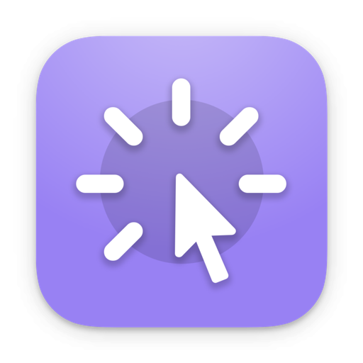

<!--idoc:ignore:start-->
> [!TIP]
> Declaration: This project is not an open-source project. The repository serves as the official website, used to collect issues and user demands. This is done to save costs, because without an official website, the application cannot pass the review.
<!--idoc:ignore:end-->

   
   
  
  <h1>
    FocusCursor
  </h1>
  <!--rehype:style=border: 0;-->
  

    <a href="./README.zh.md">简体中文</a> • 
    <a target="_blank" href="https://github.com/jaywcjlove/focus-cursor/issues/new?template=bug_report.yml">Contact & Support</a> • 
    <a href="https://github.com/jaywcjlove/focus-cursor/releases">Changelog</a>
  

  

    
  

This tool clearly highlights the cursor’s position, making its movement and clicks easily visible. It is particularly suitable for use in conferences, teaching, or video tutorial production, helping the audience follow your actions and ideas more easily, thereby attracting their attention and improving the effectiveness of information delivery.

### Features

■ Cursor Follow: Displays a circle or ring that follows the cursor’s movement.
■ Mouse Click: An animation effect appears when clicking, emphasizing the click action.
■ Mouse Mask: Focuses on the area around the cursor, dimming the rest of the screen to enhance the focus effect.
