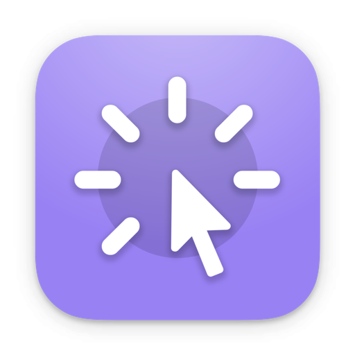

<!--idoc:ignore:start-->
> [!TIP]
> 声明：此项目并非开源项目，仓库作为官方网站，用于收集问题和用户需求。这样做是为了节省成本，因为没有官网，应用无法通过审核。
<!--idoc:ignore:end-->

   
   
  
  <h1>
    FocusCursor
  </h1>
  <!--rehype:style=border: 0;-->
  

    <a href="./README.zh.md">简体中文</a> • 
    <a target="_blank" href="https://github.com/jaywcjlove/focus-cursor/issues/new?template=bug_report_cn.yml">联系&支持</a> • 
    <a href="https://github.com/jaywcjlove/focus-cursor/releases">变更日志</a>
  

  

    
  

这款工具能够清晰地突出显示光标的位置，让光标的移动和点击一目了然。它特别适用于会议、教学或视频教程制作等场合，帮助观众更轻松地跟随你的操作和思路，从而更好地吸引他们的注意力，提升信息的传递效果。

### 主要功能

■ 鼠标跟随：显示一个圆圈或圆形跟随光标移动。  
■ 鼠标点击：点击时出现动画效果，突出显示点击动作。  
■ 鼠标遮罩：聚焦光标所在区域，其他区域变暗，增强聚焦效果。  

<!--version: v1.0.0-->